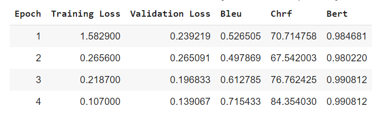

# Multilingual Domain-Specific Translation Model

## Overview

This project implements a **multilingual machine translation system** fine-tuned for translating domain-specific content, particularly related to **health insurance and TPA (Third Party Administrator)** across several languages, including **English, Arabic, French, Romanian, Italian, Spanish, Russian, Turkish, and Greek**.

The project leverages **Hugging Face's MarianMT pre-trained models** and fine-tunes them on a small, domain-specific dataset. The system incorporates advanced NLP preprocessing techniques, language detection, and multiple evaluation metrics to ensure high-quality translations.

---

## Challenges
In building the Multilingual Translation System, the biggest challenge I faced was the lack of domain-specific data, particularly in health insurance. I started with only a few key words and manually generated sentences to create a small dataset of 1000 samples. This limited data led me to freeze the final two encoder layers of the MarianMT model to preserve the underlying structure and focus fine-tuning on the specialized domain. The decision to freeze the last 2 encoder layers allowed me to retain generalization while improving performance on specialized health insurance terms.

Additionally, resource limitations made training from scratch impractical, so I leveraged Hugging Face's MarianMT model to save computational costs and ensure scalability. Balancing the need for fine-tuning with keeping the model general enough to handle unseen cases was key, alongside experimenting with different hyperparameters  like Learning rate, Epoch, and Warmup steps to avoid overfitting while optimizing translation accuracy.

---


*Figure 1: Fine Tuning Helsinki-NLP/opus-mt-fr-ar .*


## Features

- **Multilingual Translation:** Supports translation across several languages including:
  - English (en)
  - Arabic (ar)
  - French (fr)
  - Romanian (ro)
  - Italian (it)


- **Domain-Specific Focus:** Specializes in translations related to **health insurance** and **TPA** vocabulary and terminology.
- **Custom Language Preprocessing:** Language-specific preprocessing steps for each language (e.g., handling accents in French, diacritics in Romanian, and special punctuation in Turkish).
- **Model Fine-Tuning:** Fine-tuned MarianMT models for domain-specific translation tasks with support for custom tokenization, inference, and batching.
- **Language Detection:** Detects the input language using **FastText** and dynamically loads the appropriate translation model.
- **Batch Translation with Beam Search:** Translations are performed in batches with support for beam search to improve translation quality.
- **Evaluation Metrics:** Multiple metrics to evaluate the quality of the translations:
  - **BLEU**
  - **chrF**
  - **BERTScore**

---

## Project Structure

- `data_prep.py` - Code for preparing and preprocessing the dataset for training
- `train.py` - Fine-tuning and training MarianMT models
- `inference.py` - Code for performing inference (translations) using the fine-tuned models
- `metrics.py` - Evaluation code to compute BLEU, chrF, and BERTScore
- `converter.py` - Convert data from TMX to CSV
- `README.md` - Project documentation
- `.env` - Environment variables (e.g., Hugging Face API keys)


  
## Installation from TestPyPI

You can install the package directly from TestPyPI:

```bash
pip install -i https://test.pypi.org/simple/ lingowiz
```

For more information, you can view the package and its releases on TestPyPI: [Lingowiz on TestPyPI](https://test.pypi.org/manage/project/lingowiz/releases/).

---


## Streamlit Interface and Google Colab Server

This project includes a **Streamlit interface** and is deployed using a **Google Colab notebook as a server**.

To run the Streamlit interface, use the following command:

```bash
streamlit run app.py
```

The Colab notebook is responsible for handling model inference as a server. You can use the notebook as a backend service for the translation model.


   ---

## Usage

### 1. Data Preprocessing
Prepare the data for training by using the `data_prep.py` script. This script handles data normalization, diacritics removal, and language-specific preprocessing.

### 2. Model Training
Train and fine-tune the MarianMT model using the `train.py` script.

```python
from train import training_pipeline
```

# Sample call to start the training process
```python
training_pipeline(df, "general or special (domain specific)", "English", "Helsinki-NLP/opus-mt-en-ar", steps=1000, batch_size=32, lr=1e-5, epochs=3, warmup=500)
```

### 3. Translation
Perform inference on a batch of texts using the `inference.py` script. The script automatically detects the input language and translates it into Arabic or the target language.

```python
from inference import inference

text = "Sample sentence for translation"
translated_text, language_name = inference(text)
print(f"Translated Text: {translated_text}")
print(f"Detected Language: {language_name}")
```
  ### 4. Evaluation
Evaluate the performance of the translation model using the `metrics.py` script. This computes **BLEU**, **chrF**, and **BERTScore**.

```python
from metrics import evaluation

evaluation(df_test, model, tokenizer, "English")
```

   ## Evaluation Metrics

- **BLEU:** Measures how many n-grams in the prediction match the reference.
- **chrF:** Computes character-level F-score between the prediction and reference.
- **BERTScore:** Leverages BERT embeddings to measure the semantic similarity between prediction and reference.

---

## Preprocessing Overview

Each language has a custom preprocessing pipeline tailored to its linguistic rules:

- **English:** Handles contractions and lowercasing.
- **French:** Normalizes accents and punctuation.
- **Romanian:** Normalizes diacritics and cleans punctuation.
- **And more...**

## TMX to CSV Converter

This project also includes a utility to convert TMX (Translation Memory eXchange) files to CSV format, which makes it easier to preprocess and use in training. Additionally, it supports decompressing `.tmx.gz` files for easier handling of compressed translation datasets.

### How to Use the Converter

1. **Decompress TMX.gz files:**  
   The converter will automatically decompress TMX files if they are in `.gz` format.

2. **Convert TMX to CSV:**  
   After decompression, the converter transforms the TMX data into a CSV file for easier preprocessing and integration with your training pipeline.

You can find the relevant code in the converter file located in the project structure.

---

## Data Constraints

The project faces some constraints in terms of data availability, particularly domain-specific sentences related to health insurance and TPA. To overcome this, the dataset was supplemented by generating sentences for specific terms, with around 200 sentences for each key term. This might affect the model's generalization ability, but it performs well given the current data limitations.

---

## Future Improvements

- **Expand dataset:** Incorporate more domain-specific data to improve translation accuracy.
- **Additional languages:** Extend support to more languages.
- **Model improvements:** Explore using other pre-trained models for better accuracy in low-resource settings.
- **Deploy as an API:** Package the model into a REST API for easier access and usage.
- To further enhance the model's accuracy and generalization, more domain-specific data will be collected, and additional preprocessing techniques might be employed to ensure higher translation quality.
